# Tutorial 2: Designing a Computational Heat Exchanger

## Prep

Before you dive into this exercise, make sure you have [PicoGK](https://github.com/leap71/PicoGK/blob/main/Documentation/README.md) up and running and you were able to complete [Tutorial 1 using the ShapeKernel library](https://github.com/leap71/LEAP71_ShapeKernel/blob/main/Documentation/README-GettingStarted.md).

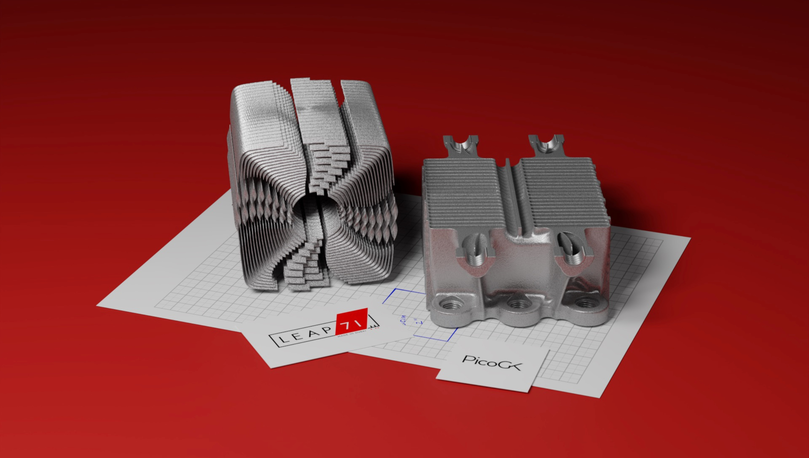


## Overview

LEAP 71 has open-sourced its foundational technology stack. This includes the voxel-based geometry kernel PicoGK and the ShapeKernel library. The latter one represents an abstraction layer to make it easier to generate basic shapes with PicoGK. Note that these two foundational layers have nothing to do with engineering design. They provide the foundation for all engineering code to run on top.  In oder to illustrate how this can be done, we are making one of our "simpler" heat exchanger designs publically available as open source. This tutorial will not dive into the details of the code itself, but it will show you how to set it up and generate advanced geometries in PicoGK under different voxel resolutions. You can go through the code on your own and might find useful things for your projects!


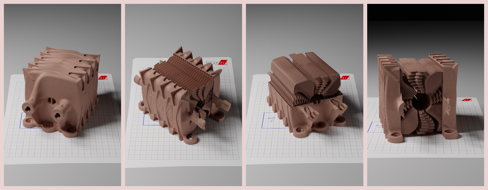

*(1) Renders of the helix heat exchanger, showing the low-res exterior and the intricate interanal features.*


Our demo part here is a helix heat exchanger with two tightly twisted (helical) voids carrying hot and cold fluid respectively. Both voids feature many thin internal fins to enhance flow guidance and heat transfer. The interior of the heat exchanger fits a 10x10x10cm box. On the exterior it carries outer structural ribs, a bottom flange, inlet / outlet (IO) threads and support features. The part was printed and tested successfully. We chose it as a beginner's example, because most of the functions needed are contained in just one class (called `HelixHeatX`). It hardly uses external components and does not require any complex object-oriented programming (OOP) / class hierarchy. The geometry is mainly created from Base Shapes and `Lattice` objects.


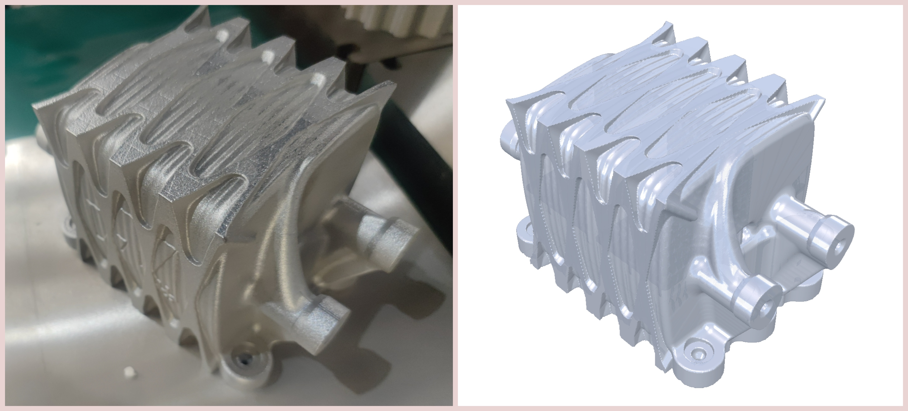

*(1) Part as printed. (2) Part as designed in PicoGK.*


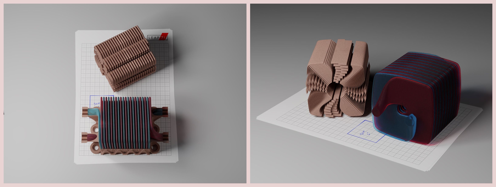

*(1) Renders of the interior details of the helix heat exchanger, showing the thin, internal guiding vanes and the two twisted fluid voids (color-coded for cold (blue) and hot (red)).*


## Including the source files

Set up a new Visual Studio (VS) project with the structure and components presented in Tutorial 1 for the ShapeKernel library. Now, we are adding a src folder for the files that are specific to the heat exchanger. 

- Beginner and Pro
  - download the source code from this repository: https://github.com/leap71/LEAP71_HelixHeatX/tree/main
  - un-zip and copy the **src folder** into your VS project folder

We recommend using the same structure for all your projects with the src folder holding the engineering code. Your VS project tree should look like this:

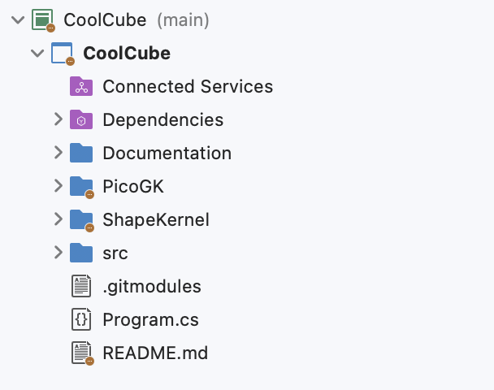


## Program.cs

Now, go into the Program.cs file and modify it by copying the code below:

```c#
using Leap71.ShapeKernel;
using PicoGK;

try
{
    PicoGK.Library.Go(
        0.5f,
        Leap71.CoolCube.HelixHeatX.Task);
}
catch (Exception e)
{
    Library.Log("Failed to run Task.");
    Library.Log(e.ToString());
    Library.oViewer().SetBackgroundColor(Cp.clrWarning);
}
```


Our helix heat exchanger object comes with a static function called `Task()` that we are passing as a delegate function into the PicoGK library. When the project is run and the library is initialised, this Task function will be excuted. In our case, the Task function simply instantiates a new helix heat exchanger object and calls `voxConstruct()` which holds all the construction logic to generate the part. Since we are using a voxel engine, there is one more thing you have to consider: the voxel size.


## Choosing a voxel size 

The voxel size sets the resolution to our voxelfields and determines the smallest detail that can be resolved as well as the resulting file sizes and runtimes needed to construct an object. During development you will find yourself going back and forth on voxel sizes, starting rather low-res to ensure fast iteration cycles and ramping up the precision for the final print file export. 

- For 1m tall objects a voxel size of 1mm is a start. For objects between 10 -100 cm, a voxel size of 0.5mm is a good first guess. A rule of thumb for PicoGK is that your smallest detail should have at least the size of one voxel. 

The table below illustrates, how our helix heat exchanger script behaves under different resolutions:

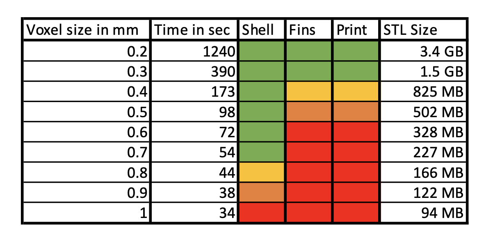

It is clear, that the iteration cycles are much faster for larger voxel sizes. The whole geometry takes 30 seconds to generate with 1mm voxels, while it takes a much longer time with 0.2mm voxel size (on a MacBook Air). This curve is not linear and in this case 0.3mm emerges as a practical sweet spot for a print resolution. Coarse voxels work well if you are developing the outer shell, which features relatively thick walls (0.9mm and more) and low detail. The internal cooling fins only have a wall thickness of 0.4mm. You will hardly be able to recognize them at 1mm voxel size. You can start working on them at 0.5mm voxel size, but if you want to have a good final mesh surface (as stated per rule of thumb) you want to go to 0.4mm and finer. The table above also illustrates how the mesh file size will behave inversely proportional to generation time and voxel size. If you are smart, you separate the code for the coarse and fine parts of your design as much as possible in your script so that you can easily e.g. only run the outer shell at low resolution or only run the cooling fins at high resolution during development.


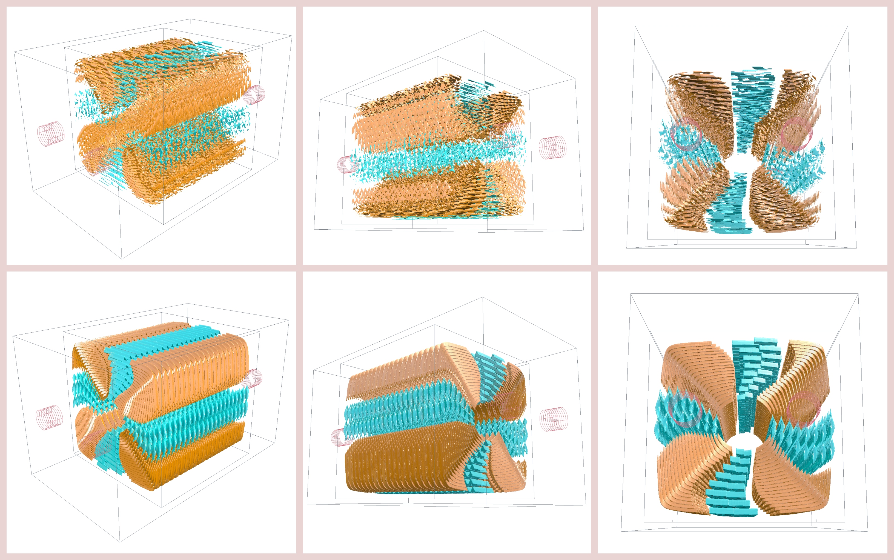

*(1) Upper row: Internal cooling fins at 1mm voxel size.*

*(2) Lower row: Internal cooling fins at 0.3mm voxel size.*


## Run it!

Now, you should be able to simply hit the Run button and let the computer generate this helix heat exchanger. The script will write some sceenshots to your output folder (defaults to your *Documents* folder, you can change that in Library.Go) along the way and it will export the STL for print at the end. The image sequence below shows the generation steps that you will observe during the program execution in the PicoGK viewer:

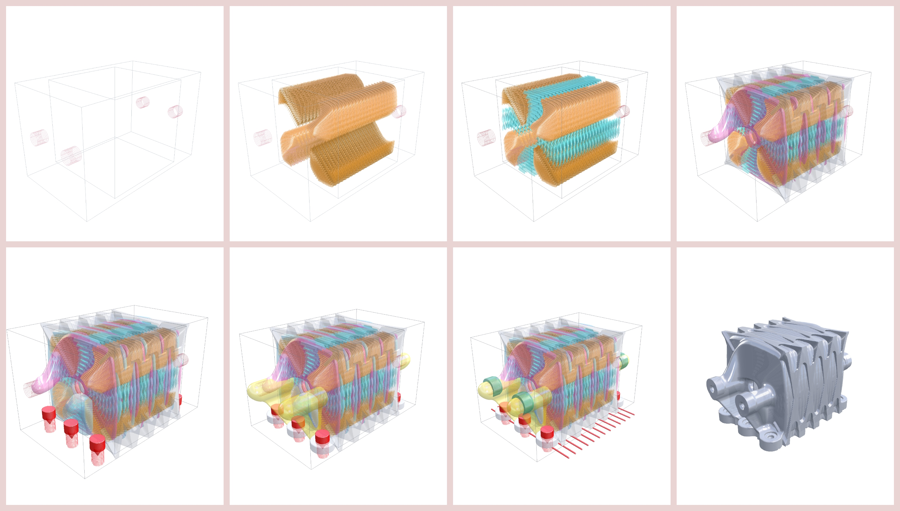

*(1) Generation sequence of the helix heat exchanger in PicoGK.*


Start with a lower resolution and work up to finer voxel sizes. For now, we will not launch into step-by-step explanation of the code itself, but we invite you to take a look by yourself. You might find usefule insights for your own projects. This heat exchanger code makes extensive use of of BaseShapes. It uses many, many "primitive" shapes that are combined logically and spatially through Boolean() operations before arriving at the final shape. This is in contrast to traditional designing methods where each component is detail-loaded right from the start and the overall number of components is rather low. Also note that we are designing the fluid voids initially and then derive the heat exchanger as a "shell" to these volumes. We are not constructing the walls per-se! 


## Diving into the code

Almost all sub-components are generated through functions inside the `HelixHeatX` class. In order to present the code nicely and tidily, the class was turned into a partial class and spread out across multiple code files with each only holding one or two functions. As you dive into the code, you will find function names that are connected to the sub-components as indicated in the images below. The function `voxConstruct()` holds the final construction logic, where all sub-components are combined into the final geometry.

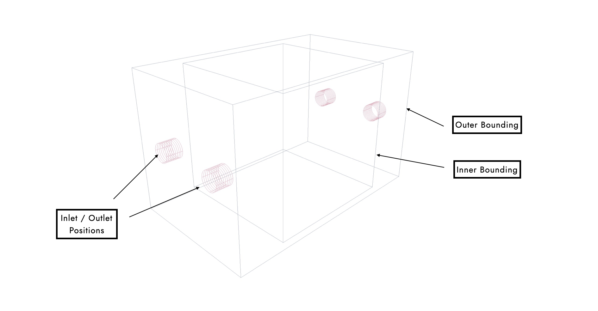The image above shows the boundary conditions of the geometry: inlet and outlet (IO) positions as well as an inner bounding box for the complex interior and an outer bounding box for the exterior. These constraints are set in the instantiation function `HelixHeatX()`.

The interior is made from two kinds of fins that are placed in alternating order inside each void. The function `voxGetTurningFins()` generates fins along the corner sections of each turn (indicated in orange color) while the function `voxGetStraightFins()` generates fins along the straights (turquoise color). The vertical fins feature a twist for improved mixing. All horizontal fins feature a rooftop-like height distribution in order to be printable inside the void. 

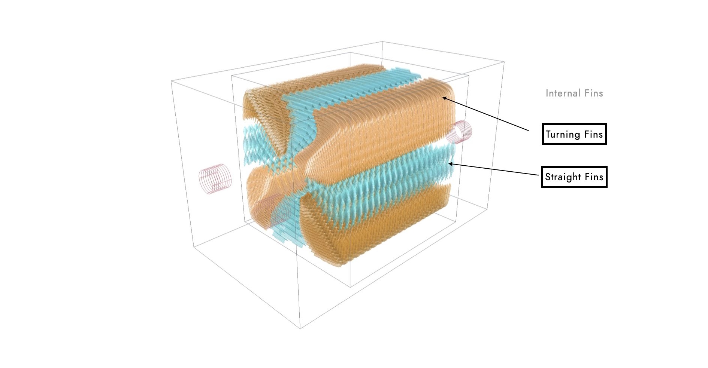The core of the heat exchanger forms two helical "disks" for the hot and cool fluid respectively. Each void is the union of the spiral section, an inlet and an outlet transition that are generated by `GetHelicalVoid()`,  `GetInlet()` and `GetOutlet()`. The resulting volumes follow an inner and an outer radius distribution (`fGetInnerRadius(float fPhi, float fLengthRatio)` and `fGetOuterRadius(float fPhi, float fLengthRatio)`). The outer radius distributions uses a supershape formula to make it a better fit to the rectangular inner boundary box.

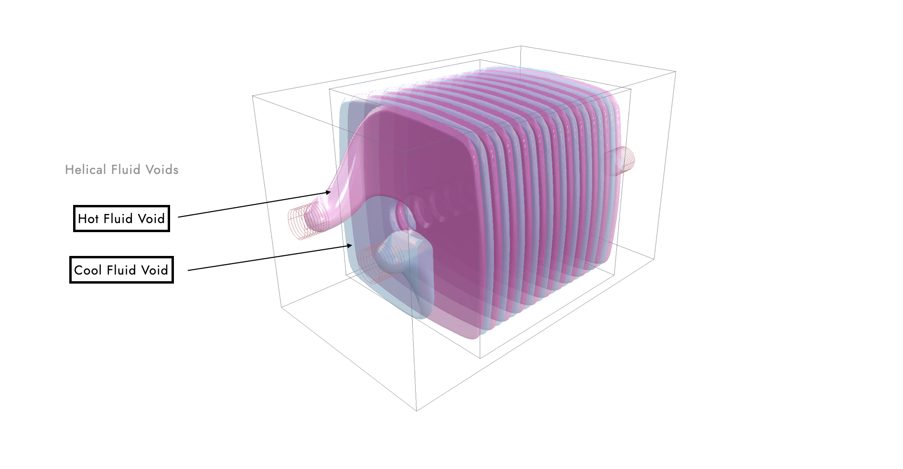The inner walls are derived from shelling these helical voids and adding the internal fins. For the exterior, we are adding a number of solid elements (as shown in the image below) through calling the functions `GetFlange()`, `AddCentrePiece()`, `voxGetIOThreads()`, `voxGetIOCuts()`, `voxGetPrintWeb()`, `voxGetIOSupports()` and `voxGetOuterStructure()` and combining them.

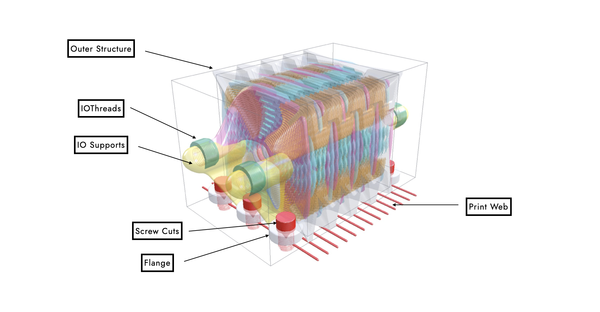

The high-level structure of this heat exchanger is clear and can be read and understood conceptually even from someone who cannot code. All our Computational Engineering Models are structured like this. Once you dive into these functions, you will need to understand coding and mathematics (obviously), but the high-level structure should be "readable". Having said this, you will appreciate one of the last operations that we call which subtracts the inner fluid volumes from the exterior to achieve the final result:

```c#
Voxels voxResult = Sh.voxSubtract(voxOuterVolume, voxInnerVolume);
```

We will continue with tutorials of much simpler geometries that allows to dive into the actual code much more. But it is important for us to give a glimpse into how complex engineering objects (and not just simple ones!) can be realized through a coding approach. 

Have fun!


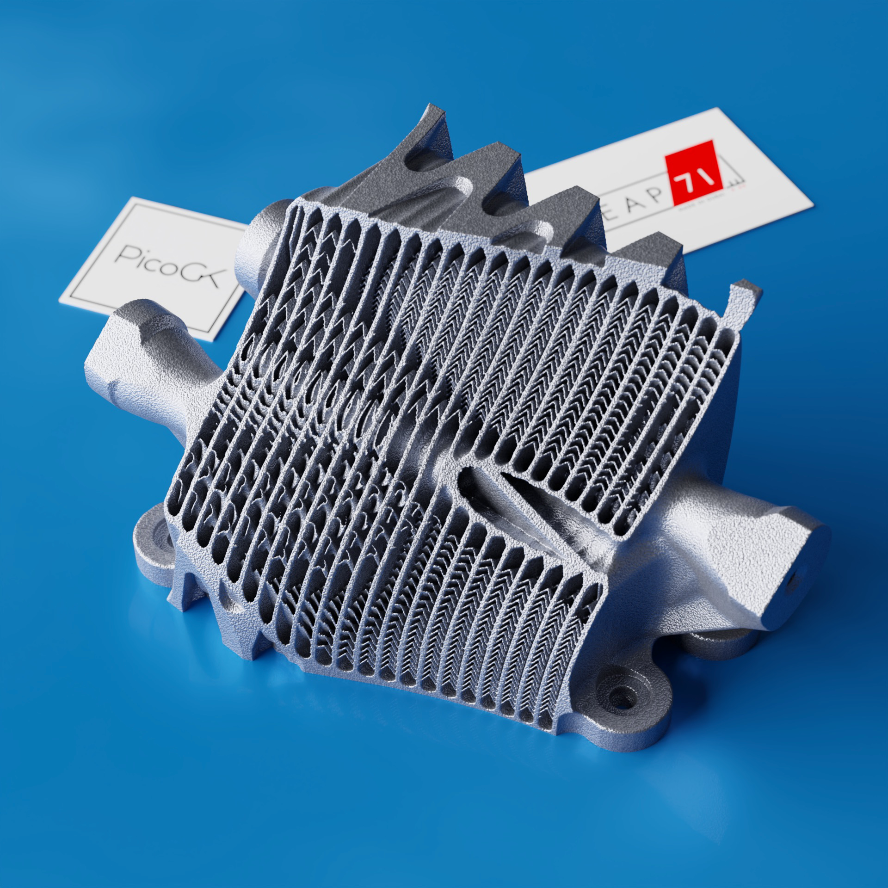

*(1) Irregular cut through the geometry, exposing the various edges of the internal fins. Note the roof-top shape to ensure printability on the horizontal fins.*